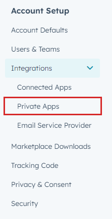
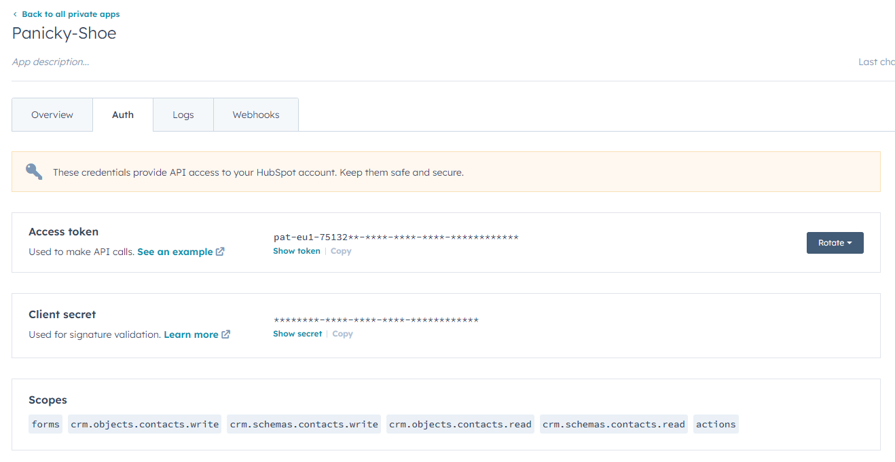
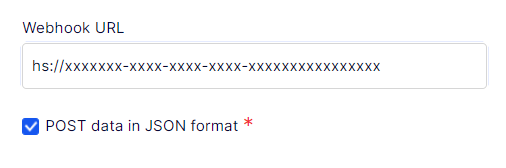
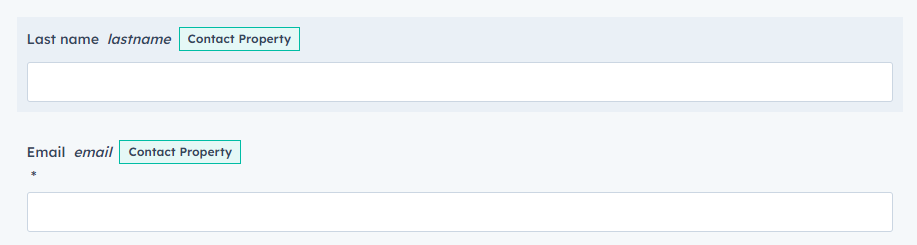
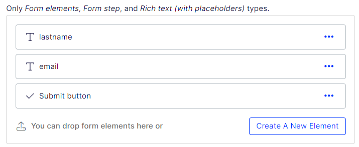
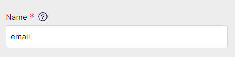

# MP.OptiForm2HubSpotPush

## Description

This package extends Optimizely Forms to allow for pushing a users' data directly into HubSpot CRM via a HubSpot Form.

## Configuration

There are three steps to getting up and running.

1. Update startup.cs
1. Update your appSetting.json
1. Configure your Optimizely Form

## Update startup.cs

Add the following to your startup.cs
```
services.Configure<HubSpotPushOptions>(_configuration.GetSection("HubSpotPush"));
```

## Update appSettings.json 

1. Log into HubSpot
2. Use the cog in the top right to enter settings


3. Then go to Private Apps



4. Here you can go to an existing app, or create a new one - either way, you should then navigate to the Auth tab, and take a copy of your apps Access token. Ensure that your app is scoped to use "forms".



5. Add this Access token as a BearerToken to appSettigns
```
 "HubSpotPush": {
   "BearerToken": "pat-xxx-xxxxxxxx-xxxx-xxxx-xxxx-xxxxxxxxxxx"
 }
```

## Optimizely Form Configuration

You need to do two things.

1. Set your Form ID
1. Configure your Optimizely Form fields

### Set your Form ID

1. Log into HubSpot
1. Go to your form
1. Edit your form
1. Click Embed, then select the option for Embdedded code
1. You will see a block of JavaScript with a formId - copy this!
```
<script charset="utf-8" type="text/javascript" src="//js-eu1.hsforms.net/forms/embed/v2.js"></script>
<script>
  hbspt.forms.create({
    region: "xxx",
    portalId: "xxxxxxxxxx",
    formId: "595073bc-4680-4d73-8744-8d1fc417a062"
  });
</script>
```
6. In you Optimizely Form goto settings
1. Add a WebHook endpoint to your form
1. This should be set to hs:// and then the formId you copied in step 5.



### Configure your Form Fields 

For each field you want to send to HubSpot, make sure that the fieldname in Hubspot (lastname, email)...



...matches the fieldname you have set in Optimizely Forms...



The label for your fields can differ, but the Name of the field must be the same



